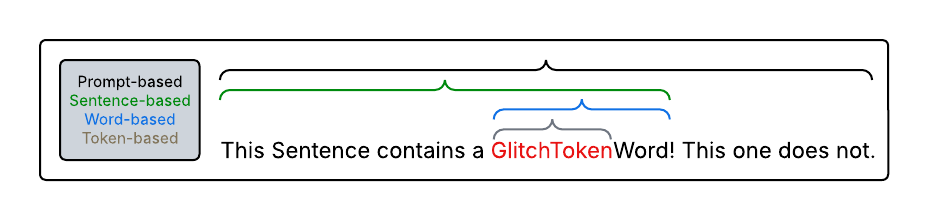

# GlitchTokenAvoidance
This Approach Presents a first way of blackbox mitigating malicious or unexpected behavior of LLMs that are error-prone to Glitch Tokens

## What is the context here?

Glitch Tokens are phenomena that occur in models that use a tokenizer to initiate the embedding process of a model execution.
These tokens can potentially harm the system and lead to false or unexpected results. To avoid the accidental usage of these tokens
in a model where these glitch tokens are present and not removable, this technique comes to use.

## What exactly is done?
Since the deployed model offers no ad-hoc mitigation, a sanitization step is introduced to ensure safe model usage.
The sanitization is done by a variation of granularity levels.

Which granularity is optimal for the problem is open to discussion and context. This application will help understanding the differences between these different strategies.

## How to use
1. Pick a strategy by selecting the token-, word-, sentence- or prompt-based approach.
2. Insert your prompt and receive a model response. If the prompt contains any glitch tokens, the prompt will be automatically adjusted based on the chosen strategy.
3. process the returned string in a desired way.

## Example
```python
from GlitchTokenAvoidance import GlitchTokenAvoidance as gta

Question = "Where do I apply for a dissertation?"
Model = "Llama3.2"
Replacement_Model = "mistral"

result = gta.ModelRequest_Sentence_based(Question, Model, Replacement_Model)
print(result)
```
